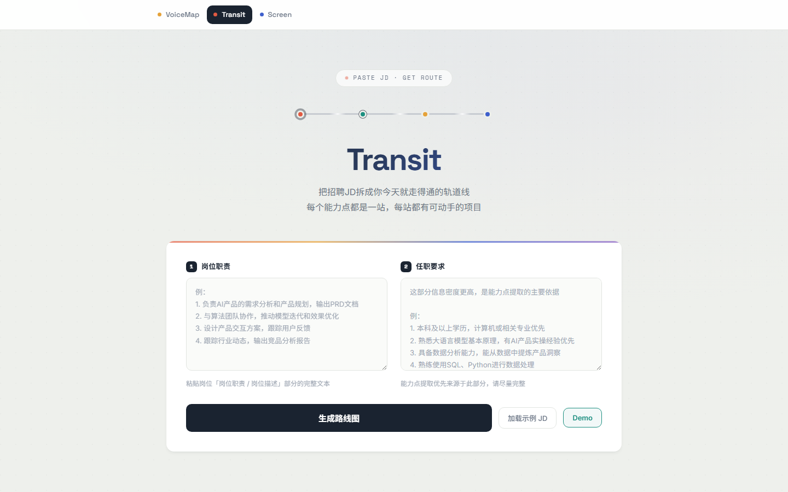
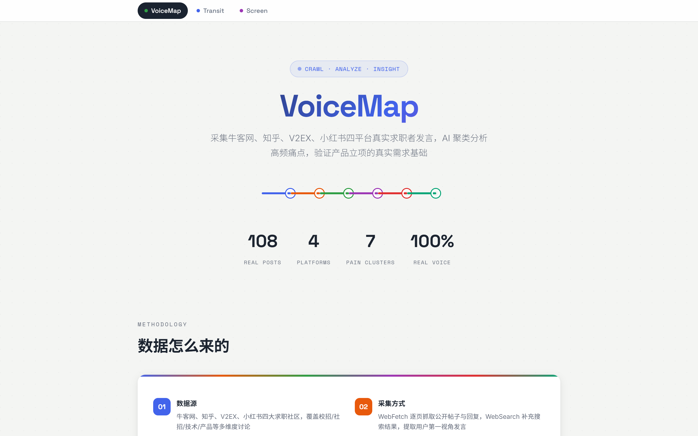
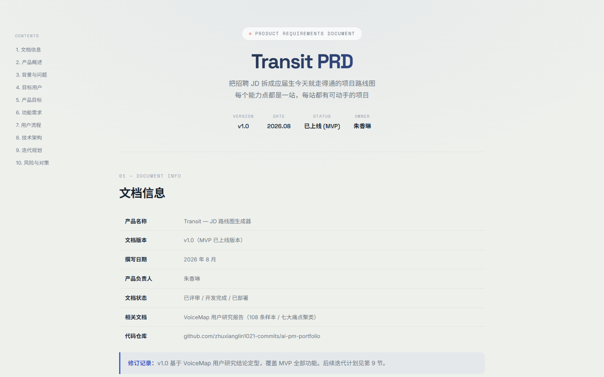
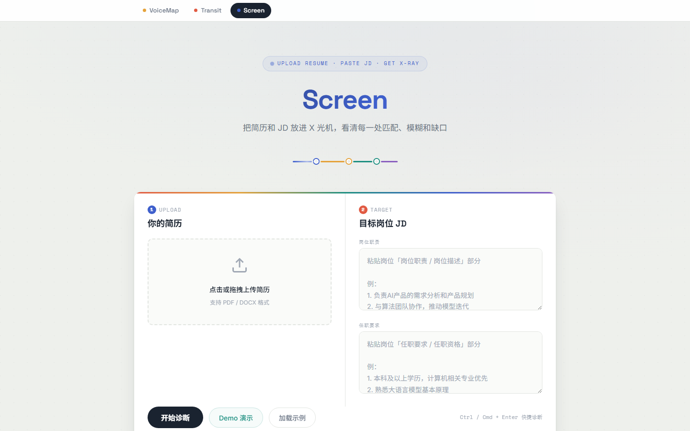
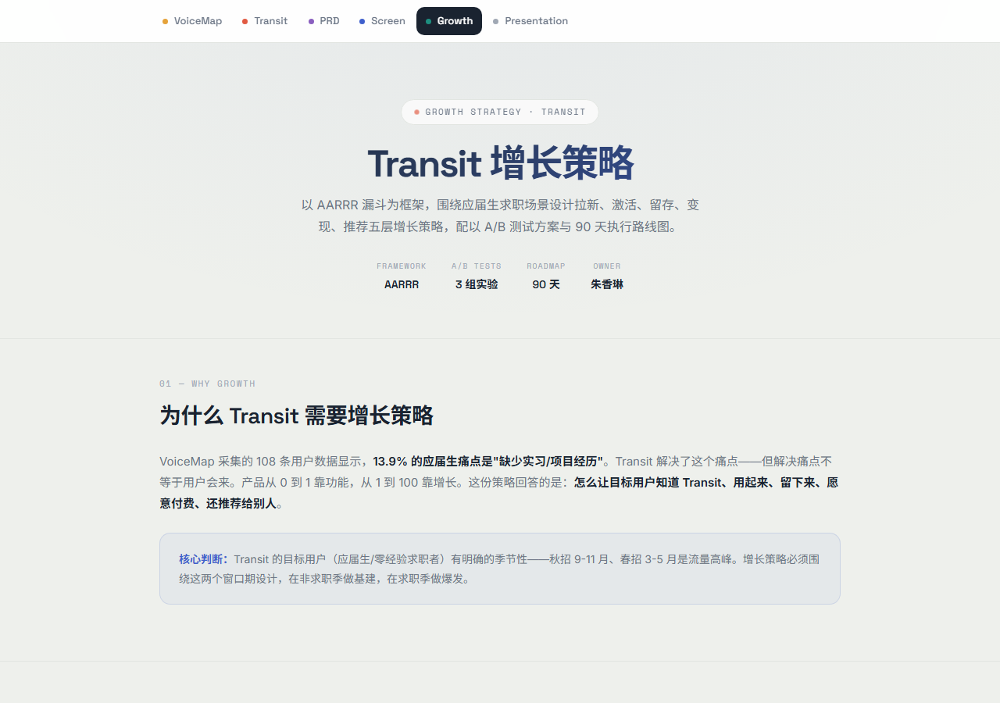
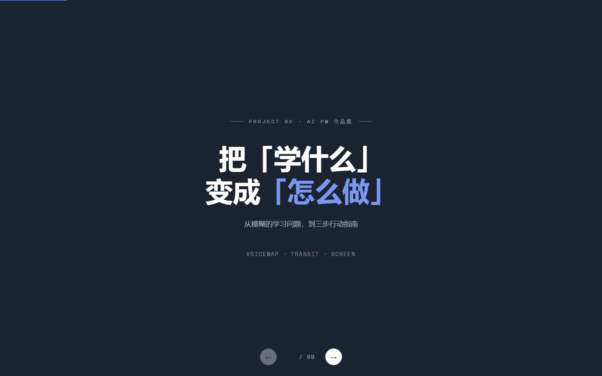

# AI PM Portfolio

> 应届生求职项目路线图工具 —— 从用户研究到产品落地的完整闭环

## 这是什么

一个 AI 产品经理作品集，包含六个模块，完整展示 **用户研究 → 产品方案 → 需求文档 → 简历优化 → 增长策略 → 项目演示** 的产品全链路能力。

## 预览

### Transit · AI Agent 求职项目路线图



### VoiceMap · 真实求职声音洞察



### PRD · Transit 产品需求文档



### Screen · 简历优化工具



### Growth · 增长策略



### Presentation · 项目演示文稿



## 模块说明

| 页面 | 文件 | 说明 |
|------|------|------|
| **VoiceMap** | `voicemap.html` | 用户研究模块。采集牛客网/知乎/V2EX/小红书四平台 108 条真实求职者发言，AI 主题聚类为 7 大痛点 |
| **Transit** | `index.html` | 核心产品。AI Agent 驱动的求职项目路线图生成器，粘贴 JD → 自动提取能力点 → 搜索真实资源 → 生成 3 个项目建议 |
| **PRD** | `prd.html` | Transit 产品需求文档 v1.0，10 章节，含 V2.0 迭代规划 |
| **Screen** | `screen.html` | 简历优化工具。AI 分析简历与 JD 匹配度，给出逐句优化建议 |
| **Growth** | `growth.html` | 增长策略模块。Transit 的增长飞轮与冷启动方案 |
| **Presentation** | `presentation.html` | 项目演示文稿 |

## 技术栈

- **前端**：原生 HTML / CSS / JavaScript，无框架依赖
- **后端**：Node.js 原生 HTTP Server
- **AI**：DeepSeek API（Function Calling / Agent 模式）
- **Agent 工具**：GitHub API（开源项目搜索）、HuggingFace API（数据集搜索）
- **部署**：Vercel

## Transit Agent 架构

Transit 不是 ChatGPT 套壳，而是一个真正的 AI Agent：

1. **自主决策**：AI 自己决定调用哪个工具、用什么关键词搜索
2. **多轮迭代**：搜一轮看结果，不够再搜，最多 8 轮
3. **基于观察调整**：看到搜索结果后决定"继续搜"还是"够了，开始生成建议"
4. **实时展示**：前端通过 SSE 流式展示 Agent 每一步的思考过程

## 本地运行

```bash
# 安装依赖
npm install

# 配置环境变量
export DEEPSEEK_API_KEY=your_api_key

# 启动服务
node server.js

# 打开 http://localhost:3000
```

## 数据来源

VoiceMap 的 108 条用户数据来自四个平台：

- 牛客网（41 条）—— 校招社区
- 知乎（31 条）—— 高质量问答
- V2EX（25 条）—— 程序员社区
- 小红书（11 条）—— 求职经验分享

通过 WebSearch + WebFetch 采集，AI 主题聚类归纳为 7 大痛点类别。